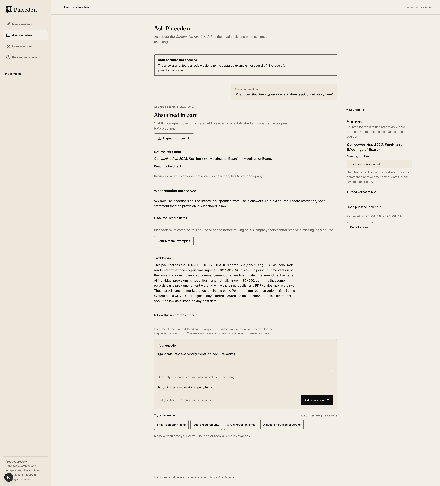

# Phase 2 — retained Ask evidence, 3 October 2026

Status: **BUILT / NEEDS_VERIFICATION**, not Phase 2 complete or production acceptance.
Build progression is authorized under D-013; deferred authentication, integration and full acceptance
checks are not blockers to independent frontend construction. Baseline `6f59bad`, product review branch
`codex/frontend-handoff`. Latest local backend reference `889ba548083ea67c8bd72b552a2bcf6d68cdf70b`;
captured legacy fixtures retain `9486600`. No backend/configuration changes or live model request.

## User outcome and decision

Previously, editing the question/company facts or starting another request removed the answer. The retained
record now remains available to compare with its Sources. Three boundaries distinguish it from the draft:
before the answer, beside the composer, and inside Sources. Its original question, facts, legal date,
provenance, findings and source text are not rewritten to match edited inputs.

The client-safe reducer manages only draft/request state. A current successful response replaces the whole
record; canceled or superseded request IDs cannot do so. Form edits abort pending transport, retain evidence,
clear obsolete field errors and never resend. Failed/invalid requests say **No new result**, not an abstention
or a new legal finding. Opening a captured example preserves an existing unchecked draft. Returning inputs to
their earlier values remains conservatively unchecked; no serialized confidential-input comparison is added.

No history, browser storage, restored facts or persistence is implied. Reload clears this page's draft/record
state; a named example URL loads its public captured fixture again. Backend-owned conversations are unchanged.
See D-014 for rejected alternatives and reversal condition.

## Verification

| Check | Evidence |
|---|---|
| TypeScript / quiet ESLint | PASS |
| Core contracts | PASS, 38 assertions |
| Captured fixtures | PASS, 773 assertions / 13 fixtures |
| Ask contracts | PASS, 7 captured fixtures |
| Workspace gateway | PASS, 452 assertions / 47 offline cases |
| Reducer/static render | PASS, 256 assertions / 5 captured Ask records; independent reviewer also reran |
| Conversations | PASS, contract/ownership/local-gate/CSRF/path/redaction checks |
| Loop configuration / runner | PASS / 8 assertions |
| Webpack production build | PASS, 27 routes |
| Bundle budget | PASS, 49 chunks / 400,076 gzip bytes; +503 bytes from prior slice, existing limits unchanged |
| Diff whitespace | PASS before commit |

Reducer/render tests cover retained identity and untouched data across five real captured records, edits,
pending requests, failed/invalid completion, canceled/older response and rejection, successful whole-record
replacement, sample versus local boundaries, blank drafts, retained legal dates and source-caption markup.
They do **not** establish an end-to-end mocked-fetch interaction harness or connected browser failures.

Bounded native Brave inspection used the existing localhost preview and `ask-partial` captured example:

- Typed a disposable synthetic QA draft, opened Sources, added **Section 173** to draft provisions, and
  used Clear details. The original captured answer remained; context cleared but the question did not.
- Confirmed the unchecked-draft notice and retained-record source caption in the accessibility tree.
- Read-only visible DevTools measurements with Sources open: viewport/body width 1920/1920, answer 800px;
  viewport/body width 320/320, answer 288px. Notice remained present. Resource entries for the Ask endpoint
  were zero after these edits, confirming no automatic submission in that observed session.
- Saved/visually inspected the page-only screenshot below. No browser chrome, credentials or matter data.
- Initial blank repaint resolved when DevTools opened, as in the earlier preview. This was not treated as a
  passing app interaction. Command-palette miss was retargeted using fresh native state before capture.
- Disabled temporary device emulation, closed DevTools and navigated the same captured-fixture URL to remove
  the disposable QA draft. Empty question field confirmed; no user-created draft was discarded.

## Lean review and limits

One independent read-only R2 reviewer combined Devil's Advocate/execution-checker and simulated Indian-lawyer
perspectives. Initial objections: old evidence mistaken for edited facts, misleading failure announcements,
canceled responses winning, and Sources losing their originating record. The changed reducer, warning/caption
and tests address those risks. Actual-diff response round found no new concrete defect or required change,
and independently reran 256 assertions. Simulated personas are not practitioner acceptance.

Main agent inspected backend `checker/ask_contract.py` at the explicit SHA; returned states, evidence and
legal-date semantics are unchanged. A guessed `gateway/ask_contract.py` path did not exist; the actual path
was resolved from the Git tree. No absence-of-feature inference was made.

Remaining full accessibility/error-state/browser/CI, production sign-in and live connection/persistence/source
acceptance are **DEFERRED / NOT RUN**, per D-013, not waived. Production remains gated; no merge/deployment.
Next independent Phase 2 build slice: real bounded task/run updates after inspecting pinned run contracts.
