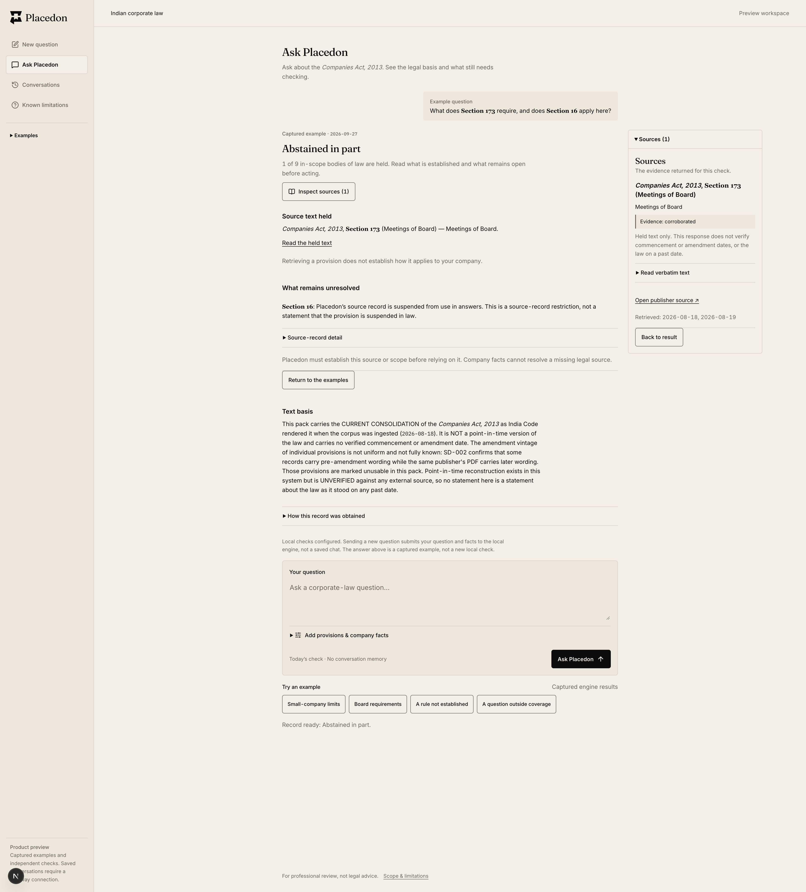

# Phase 1 — Brave acceptance, 3 October 2026

Status: **PARTIAL ACCEPTANCE / NEEDS_VERIFICATION**. This closes the measured independent-Ask
layout and keyboard checks, not Phase 1, production authentication or pilot approval.

Initial layout/keyboard code tested: checkpoint `7435ae1`. A subsequent bounded copy patch was reviewed,
tested and checked at 320/1920px as recorded below. Latest backend compatibility evidence remains pinned
to `889ba54`; the public captured fixture retains its original `9486600` provenance. Native Brave on macOS,
existing localhost:3300 preview, public captured partial fixture
`/workspace/ask?example=ask-partial`. No question submitted, model invoked or backend mutated.

## Measured layout

Brave DevTools Responsive mode; actual `innerWidth`, document scroll width and DOM bounding rectangles
read from the visible Console. Each accepted row has closed/open Sources measurements. Values are CSS px,
rounded to two decimals. Answer position and width are identical in both states.

| Viewport | Body width, closed/open | Answer left, both | Answer width, both | Sources left, open | Sources right, open |
|---|---|---|---|---|---|
| 320 | 320 / 320 | 16 | 288 | 16 | 304 |
| 360 | 360 / 360 | 16 | 328 | 16 | 344 |
| 400 | 400 / 400 | 16 | 368 | 16 | 384 |
| 768 | 768 / 768 | 247.04 | 497.91 | 247.04 | 744.95 |
| 1024 | 1024 / 1024 | 254.72 | 738.55 | 254.72 | 993.27 |
| 1440 | 1440 / 1440 | 432 | 800 | 432 | 1232 |
| 1800 | 1800 / 1800 | 612 | 800 | 1436 | 1756 |
| 1920 | 1920 / 1920 | 672 | 800 | 1496 | 1816 |

PASS: no horizontal body overflow in these states. Sources stays in flow below 1800px; at 1800px it
occupies spare right margin with 44px remaining, without shifting the 800px answer. At 1920px the right
margin is 104px. Focus moves to the Sources heading on opening and to the result heading on return.

One uncommitted width-input attempt produced 4px, and some scaled-preview clicks missed their targets.
Those attempts were excluded. Widths were re-entered and accepted only after actual viewport and
`sourcesOpen` were confirmed. These were automation misses, not evidence of product failures or passes.

## Keyboard, zoom and sampled accessibility

- PASS: from address-bar focus, Tab reaches the root skip link, next Tab reaches **Skip workspace
  navigation**. Enter focuses the workspace content after navigation; next Tab reaches Inspect sources.
- PASS: Enter opens Sources and focuses its heading. Tab reaches Read verbatim text; Enter expands the
  held excerpt. Tab reaches the publisher link, then Back to result. Enter returns focus to the result
  heading. The publisher link was not followed.
- PASS: Brave explicitly reported **200%** zoom. With DevTools docked, actual viewport/body width was
  355/355px; answer left/width 16/323px in both Sources states, Sources right 339px. Keyboard activation
  remained usable. The non-docked 200% view was also visually inspected; this is not all-state zoom proof.
- PASS, sampled: DevTools emulation reported reduced motion true; secondary-control transition and
  workspace animation durations were 0s. Restoring emulation returned false and 0.14s control transitions.
- PASS, sampled: rendered intro/mode-note grey `rgb(107,102,95)` on cream `rgb(244,239,230)` has 4.97:1
  contrast. Primary cream on ink `rgb(12,12,13)` has 17.07:1. Ratios calculated using sRGB relative
  luminance. Sampled primary/secondary buttons and navigation link were 44px high. This is not a full
  contrast, target-size, focus-indicator or WCAG audit.

Temporary device emulation was disabled, reduced-motion override removed, browser zoom restored to 100%,
and DevTools closed. Existing user tabs were preserved.

## Visual evidence

Page-only Brave full-size screenshot at 1920 CSS px / 2x device pixel ratio (3840×4246 image).
It contains the labelled captured fixture and empty question field, no browser chrome, credentials or
client documents. The lower-left Next development badge is preview tooling, not production UI.
The original pre-copy capture is retained as `evidence/phase1-sources-1920.png` for comparison.

## Bounded reviewer response and regression

One read-only execution-checker/Devil's Advocate reviewer with a simulated Indian-lawyer lens found:
the established-text heading could overstate operative-law evidence; the internal SUSPENDED label could
read as statutory suspension; and the composer advertised availability when its gate only checks local
configuration. No real practitioner review is claimed.

- Changed the heading to **Source text held**. For a false backend point-in-time flag, the source panel
  now places the commencement/amendment/past-date qualification immediately after evidence status.
- The exact suspended-source message is presented as **Section 16** and an explicit source-record
  restriction, with the unchanged technical message retained in a closed disclosure. Other messages are
  preserved verbatim; no inferred source status or statutory outcome.
- The composer says local checks are configured and explains that submitting a new question is distinct
  from the captured answer. No health check or connected availability is claimed.

Response-round review found no new concrete defect. Its limitation about test adjacency was addressed
with an explicit immediate-neighbour render assertion. The reviewer did not execute tests or view the
new capture; main-agent Brave inspection confirmed the revised labels and source qualification.

Post-copy Brave regression: at 320px open/closed body width 320, answer left/width 16/288 and Sources right
304, focus Sources/result headings. At 1920px Sources open: body 1920, answer left/width 672/800, source
left/right 1496/1816. Full eight-width/zoom/motion measurements above precede this text-only patch; no
layout/focus rules were changed. New final capture was visually inspected. Device emulation was again disabled.

Post-copy gates: TypeScript, quiet ESLint, all contracts (38 core / 773 fixture / 452 gateway / 141 render,
plus Ask and conversation suites), loop validation/8 runner assertions, webpack build/27 routes and bundle
budget PASS. Final budget: 49 chunks / **399,573 gzip bytes**, +335 bytes from the previous implementation.
Render assertions were rerun after strengthening adjacency. No default-build/CI claim is made.

## Boundaries and remaining gates

- Screen-reader testing, complete contrast/focus audit, other result/error states and actual practitioner
  review remain unverified. This report covers independent Ask, not connected conversation Sources.
- Q-001: founder-approved production session/principal mapping remains undecided.
- Q-007/Q-008: approved synthetic gateway/store setup and narrow message-scoped source fix are needed for
  connected role, persistence and citation acceptance. No v2 URL/key was introduced.
- Default Turbopack CI/preview and founder acceptance remain unverified. No merge or deployment.
- Editing facts still clears prior evidence; the explicit stale-record boundary remains a Phase 2 item.

Engineering gates were rerun because the bounded copy patch changed application code. Historical values
in PHASE_1_SHELL_ACCEPTANCE.md describe its earlier checkpoint, not this patch. Verify diff before commit.
